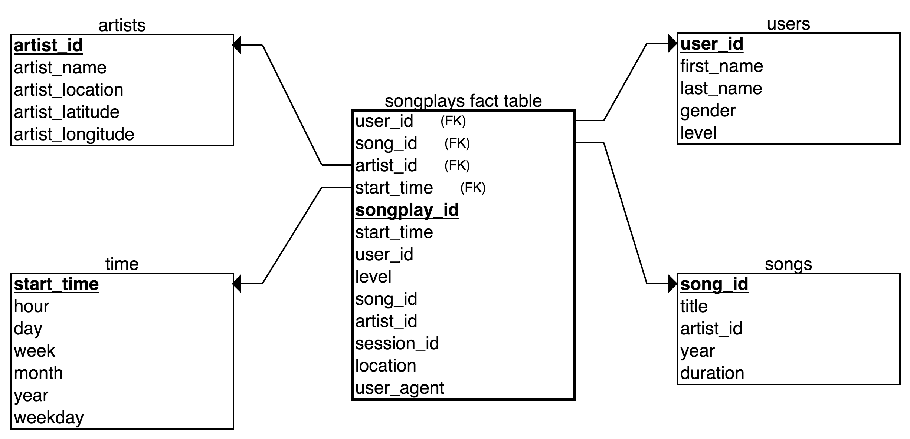

# UDE-redshift

Cloud-based Data Warehouses (DWH) are widely used by companies as part of their underlying infrastructure to process and analyze raw data. Cloud providers like Amazon Web Services (AWS) provide products, like [Redshift](https://aws.amazon.com/redshift/?whats-new-cards.sort-by=item.additionalFields.postDateTime&whats-new-cards.sort-order=desc), where data engineers can implement and manage a data playground. Such playground is build with the goal of organizing the meaningful information contained in the raw data. DWHs are key for analysts to execute queries against the tables that conform the database and, in this way, to derive insights from their result.

The goal of this repository is to build a cloud-based DWHs. For this purpose we will make use of Amazon Redshift. We will design a data pipeline that will process and organize raw data into a star-shaped schema. The work presented here can be thought as an extension of the use-case presented in [this repository](https://github.com/juferafo/UDE-postgres).

This repository is organized as follows: 

### Project raw datasets

We are going to ilustrate the work presented here with the following use-case: let's assume that we are working for a music streaming startup and we are interested in migrating our on-premise data to the cloud. Our work is to design the DWH's structure of and to the implement this migration programatically. The raw data is divided into two large datasets: the song dataset and the log dataset.

#### Song dataset

The song dataset is a subset of the [Million Song Dataset](http://millionsongdataset.com/). It contains information about the songs available in the streaming app like artist_id, song_id, title, duration, etc... Each entry (row) of this dataset is written as a JSON file that are organized in folders with the following structure:

```
./data/song_data/
└── A
    ├── A
    │   ├── A
    │   ├── B
    │   └── C
    └── B
        ├── A
        ├── B
        └── C
```

Below you can find an example of the information contained in the song data file `song_data/A/A/B/TRAABJL12903CDCF1A.json`.

```
{
    "num_songs": 1, 
    "artist_id": "ARJIE2Y1187B994AB7", 
    "artist_latitude": null,
    "artist_longitude": null,
    "artist_location": "",
    "artist_name": "Line Renaud",
    "song_id": "SOUPIRU12A6D4FA1E1",
    "title": "Der Kleine Dompfaff",
    "duration": 152.92036,
    "year": 0
}
```

#### Log dataset

The log dataset contains information about the usage of the application by the customers. This dataset is build from the event simulator [eventsim](https://github.com/Interana/eventsim) and, like the song dataset, the data is stored in JSON files. Below you can find the different fields present in this dataset. As one can expect, from these logs one can derive user-based insights that are key when bussiness deciscissions are made.   

```
{
  artist TEXT,
  auth TEXT,
  firstName TEXT,
  gender TEXT,
  itemInSession INT,
  lastName TEXT,
  length DOUBLE,
  level TEXT,
  location TEXT,
  method TEXT,
  page TEXT,
  registration DOUBLE,
  sessionId INT,
  song TEXT,
  status INT,
  ts FLOAT,
  userId INT
}
```

For convenience and since this project is based on cloud technologies the aforementioned datasets were placed in a [S3 bucket](https://aws.amazon.com/s3/). Amazon S3 is an object storage service that allows to store high volume data in a way that this one is cost effective, highly available, secure and easy to retrieve from other AWS services like S3. Below you can find the S3 links

* Song data: s3://udacity-dend/song_data
* Log data: s3://udacity-dend/log_data

### Data Warehouse structure

As mentioned earlier, our goal is to bring data located in S3 into the DWH. Widely speaking, we can divide the structure of our system in two areas: the staging area and the DW area.

#### Staging area

The Staging area is the place where the input or so-called raw data is located. In our case this will be the S3 buckets that host the song and log datasets. In this area the data is in the original format and, as one can imagine, it is necessary to implement set of Extract-Transform-Load (ETL) pipelines to organize the data into the desired format within the target place. A detailed description of the ETL procedure is provide in the next section.

#### Data Warehouse area

The DW area is the final location of the input data. In there, the song and log data will be organized in a [normalized form](https://en.wikipedia.org/wiki/Database_normalization) with the shape of a [star-schema](https://www.guru99.com/star-snowflake-data-warehousing.html). A database designed with a star-shaped schema is built around the so-called fact-table that in our case contains information of the songs played. Around the fact table we will find the dimension tables that are used to store descriptive material like, for example, for example, artist or user data. Below you can find below the schema of each table present in the DW area.

##### `songplays` fact table

```
songplay_id SERIAL PRIMARY KEY,
start_time BIGINT, 
user_id INT, 
level VARCHAR, 
song_id VARCHAR, 
artist_id VARCHAR, 
session_id INT, 
location VARCHAR, 
user_agent VARCHAR
```

##### `artist` dimension table

```
artist_id VARCHAR PRIMARY KEY,
artist_name VARCHAR,
artist_location VARCHAR,
artist_latitude INT,
artist_longitude INT
```

#### `song` dimension table

```
song_id VARCHAR PRIMARY KEY,
title VARCHAR,
artist_id VARCHAR,
year INT,
duration FLOAT
```

##### `time` dimension table

```
start_time BIGINT PRIMARY KEY,
hour INT,
day INT,
week INT,
month INT,
year INT,
weekday INT
```

##### `user` dimension table

```
user_id INT PRIMARY KEY,
first_name VARCHAR,
last_name VARCHAR,
gender VARCHAR,
level VARCHAR
```

Below you can find an the relation between the dimensions and fact tables that produces the aforementioned star-schema.



### Extract-Transform-Load (ETL) pipeline

An ETL pipeline is a programatic procedure used by data engineers to retrieve data from a particular source (extract), to modify its information in order to meed certain  validation requirements (transform) and to save it into a database or another storage service (load). For our use-case we need also create the tables present in the DW area so the load step is executed successfully. 


The different stages of the pipeline are discussed in the below subsections. 

#### Extract

#### Generation of the DW star-schema

#### Transform

#### Load

### Sample queries
